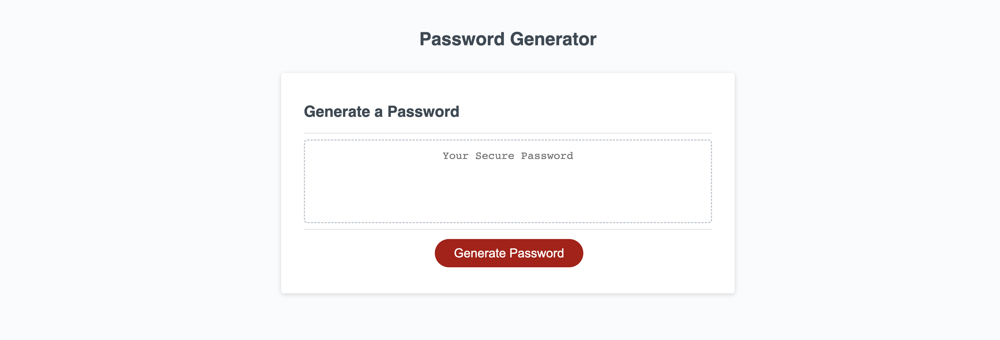

# Employee Password Generator

## Description

This challenge for UofTor coding bootcamp was to practice the basics of JavaScript.  In it I had to find a way to write out the specifications of what I needed the generator to ask and also to write a random number loop that could generate based off the user's input.  I learned more about what I can do with simple JavaScript code that is not overly complicated but still powerful.

## Usage

When you click the generate password button you will be presented with two prompt.  One will ask you for a password length, the other will ask you what type of characters you would like in your password based off four possible choices: lowercase, uppercase, numeric, and special.  Once you have inputed your password criteria, the JavaScript will generate and present a random password based on your specifications.  This can be repeated until a satisfactory password is generated.

## License

Refer to LICENSE
